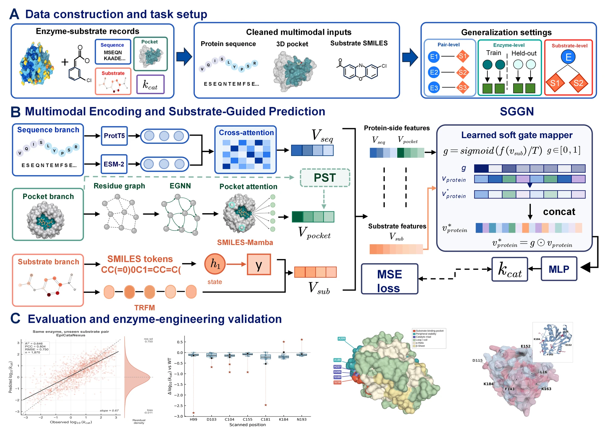
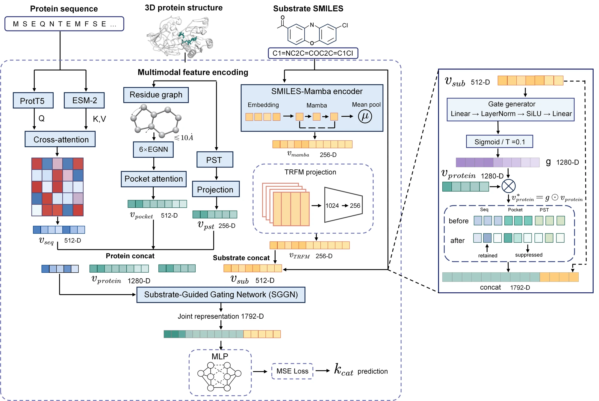
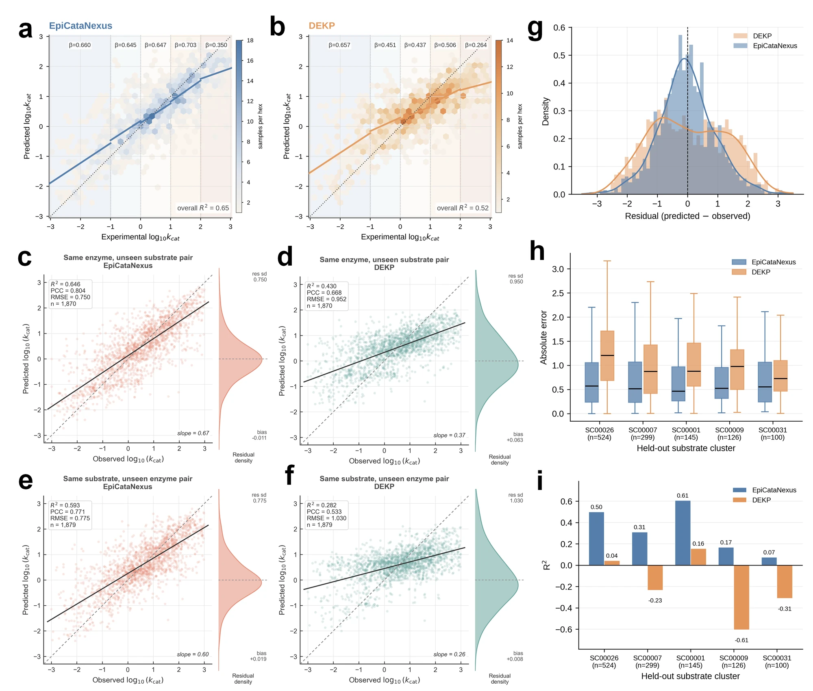
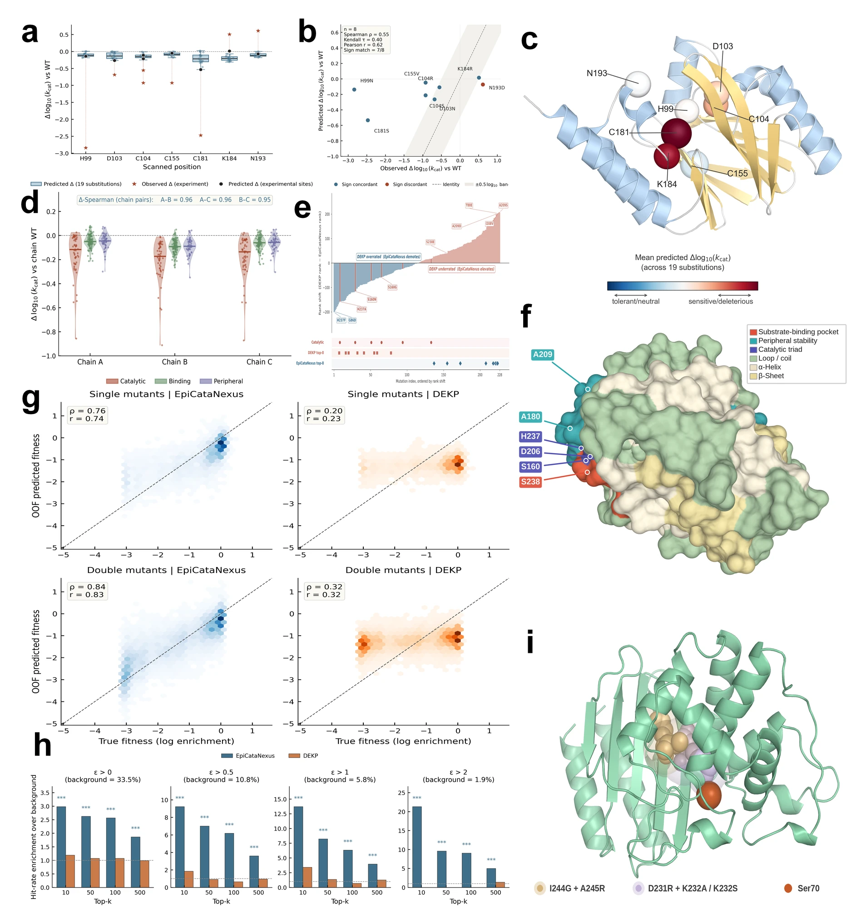
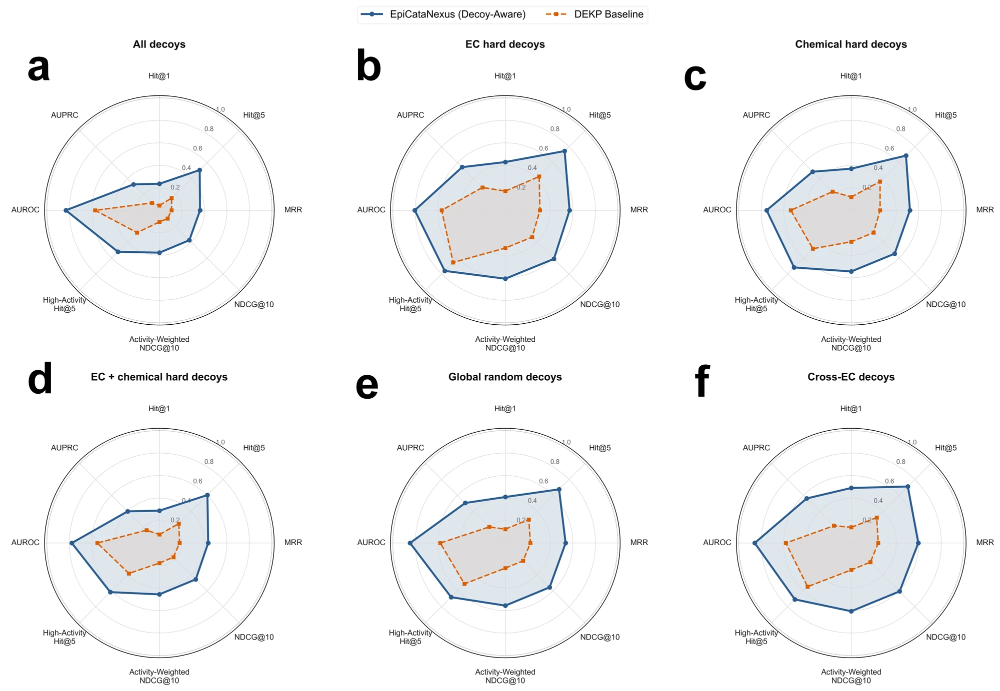
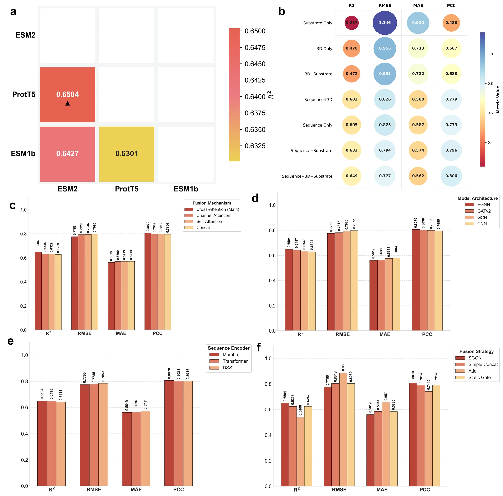
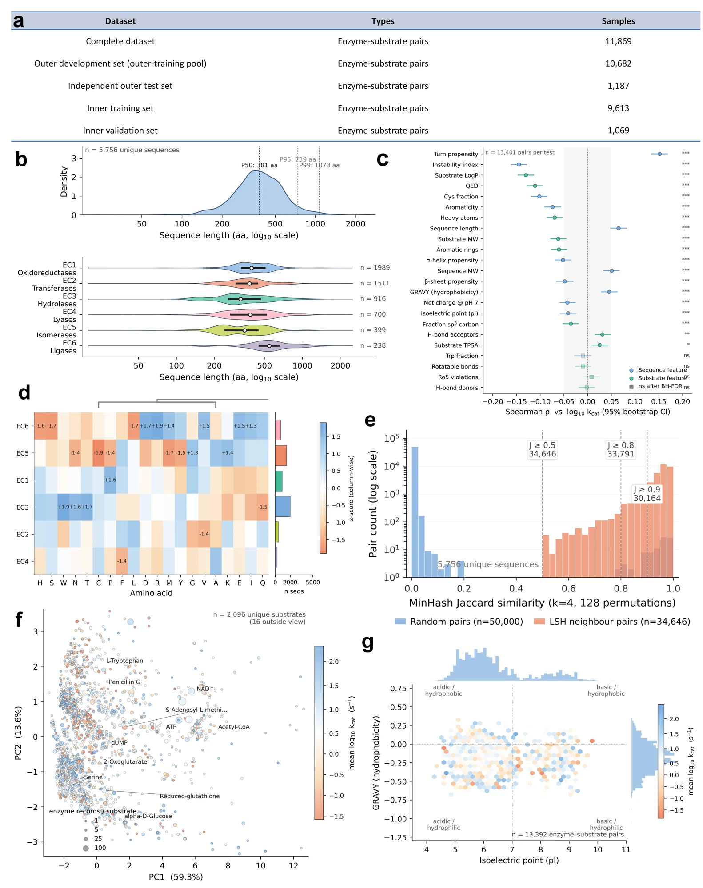

# EpiCataNexus

**A substrate-guided, pocket-aware model bridging kinetic prediction and enzyme
engineering-oriented virtual screening.**

<p>
  
  
  
  
</p>

> Release status: research preview accompanying a manuscript that has not yet been
> formally published. Checkpoint/data URLs, paper identifiers, and the final software
> license will be added when they are available.

[中文说明](README_zh.md) · [Installation](docs/INSTALL.md) ·
[Data](docs/DATA.md) · [Reproducibility](docs/REPRODUCIBILITY.md) ·
[Weights](docs/WEIGHTS.md) · [Model card](MODEL_CARD.md) ·
[Engineering workflows](docs/ENGINEERING_TASKS.md) · [Contributing](CONTRIBUTING.md)

<p align="center">
  
</p>

EpiCataNexus treats substrate chemistry as a query over protein context. It combines
residue-aligned ProtT5–ESM-2 cross-attention, a geometry-predicted pocket graph,
pretrained structural features, and a hybrid SMILES encoder. A substrate-guided gating
network (SGGN) recalibrates protein-side evidence before predicting `log10(kcat)` or
`log10(Km)`.

## Highlights

- **Substrate-conditioned protein states.** The same enzyme can receive a different
  effective representation for different substrates.
- **Pocket-aware geometry.** A six-layer distance-based EGNN operates on an
  annotation-free candidate pocket extracted with fpocket.
- **Multimodal sequence and chemistry.** Residue-level ProtT5/ESM-2 fusion is combined
  with SMILES-Mamba and a pretrained SMILES Transformer representation.
- **Engineering-oriented transfer.** The learned relation supports mutation ranking,
  epistasis enrichment, and reciprocal substrate prioritization.

## Architecture

<p align="center">
  
</p>

For a prepared batch, the reference implementation computes

```text
ProtT5 residues ─┐
                 ├─ cross-attention ───────────────┐
ESM-2 residues ──┘                                  │
Pocket graph ───── six-layer EGNN ─ gated readout ─┼─ protein state
PST embedding ──────────────────────────────────────┘
                                                        ├─ SGGN ─ regression/ranking
SMILES tokens ─── Mamba ───────────────────────────┐    │
TRFM embedding ─────────────────────────────────────┴─ substrate state
```

The default dimensions are 512 (pocket), 512 (sequence), 256 (PST), 256
(SMILES-Mamba), and 256 (TRFM). SGGN therefore gates a 1,280-dimensional protein
state using a 512-dimensional substrate state and produces a 1,792-dimensional joint
representation.

### Canonical manuscript implementation

The public architecture has one canonical path: residue-level ProtT5 and ESM-2 states
are aligned and fused before masked mean pooling; the candidate-pocket graph is encoded
by six EGNN layers; SMILES-Mamba/TRFM conditions the protein state through SGGN; and
an MLP trained with mean squared error predicts the kinetic target. No external
tree-based regressor is part of this implementation.

The separately released pooled-feature checkpoints are retained through
[`epicatanexus.legacy_pooled`](epicatanexus/legacy_pooled/). They use one pooled
ProtT5 vector and one pooled ESM-2 vector per protein and are therefore loaded through
the compatibility class, not through the residue-level `EpiCataNexus` class above.

## Main results

This repository provides a public implementation of the EpiCataNexus architecture
described in the paper. The values below are results reported in the paper. The
planned initial external weight release will contain only the pooled-feature neural
checkpoints for `kcat` and `Km`; task-specific XGBoost weights are not distributed.

The reported independent-test performance is:

| Target | Test rows | R² | RMSE | MAE | PCC |
|---|---:|---:|---:|---:|---:|
| `log10(kcat)` | 1,187 | 0.6470 | 0.7769 | 0.5618 | 0.8049 |
| `log10(Km)` | 1,984 | 0.6802 | 0.7253 | 0.5228 | 0.8253 |

The complete auditable summary is in [`results/paper_metrics.csv`](results/paper_metrics.csv).

<p align="center">
  
</p>

## Pooled-feature checkpoint compatibility

The two external task checkpoints use the same 15.5-million-parameter neural
architecture and include the pocket EGNN, pooled ProtT5/ESM-2 fusion, SMILES-Mamba,
TRFM/PST projections, SGGN, and the task regression head.

| Task | Historical filename | Public location |
|---|---|---|
| `kcat` | `best_pocket_mamba_1792_clean_sggn.pkl` | To be added after the external release |
| `Km` | `best_pocket_mamba_1792_km_sggn.pkl` | To be added after the external release |

Validate either trusted checkpoint with strict state-dict matching:

```bash
python scripts/verify_legacy_checkpoint.py /path/to/checkpoint.pkl
```

See [docs/WEIGHTS.md](docs/WEIGHTS.md) and [MODEL_CARD.md](MODEL_CARD.md) for the
input contract, scope, and limitations.

## Engineering-oriented evaluation

EpiCataNexus was evaluated beyond pointwise kinetic regression:

- **P25910 single mutants:** 7/8 observed directions recovered; Spearman 0.551 and
  Pearson 0.618 for mutation effects.
- **PETase–MHET scan:** 228 variants evaluated across three structural templates;
  pairwise Spearman correlations exceeded 0.951.
- **TEM-1 double mutants:** NDCG@10 of 0.7716 for positive-epistasis prioritization.
- **Substrate recovery:** Hit@5 of 0.5062, high-activity Hit@5 of 0.5212, and AUROC
  of 0.8309 in the composite candidate pool.

<p align="center">
  
</p>

<p align="center">
  
</p>

## Installation

```bash
conda env create -f environment.yml
conda activate epicatanexus
pip install -e .
```

The full substrate encoder additionally requires a `mamba-ssm` build compatible with
the installed PyTorch and CUDA versions. See [docs/INSTALL.md](docs/INSTALL.md).

## Quick checks

The lightweight check requires no model weights or source databases:

```bash
python scripts/smoke_test.py
pytest
```

It verifies the configuration, metric implementations, rotation invariance of the
pocket encoder, residue-attention tensor contract, and checksums of the original and
web-optimized paper figures. Generate a tiny synthetic prepared batch with:

```bash
python scripts/create_example_batch.py --output outputs/example_batches.pt
```

The generated tensors contain no research data and are intended only for interface
validation.

## Data preparation

Create the nested outer-test/inner-validation split used in the paper:

```bash
python scripts/prepare_data.py \
  --input data/processed/kcat_manifest.tsv \
  --output-dir data/splits/kcat \
  --seed 3407
```

For 11,869 valid records this produces 9,613 training, 1,069 validation, and 1,187
independent test rows. Feature preprocessing and the prepared-batch schema are
documented in [docs/DATA.md](docs/DATA.md).

## Training and evaluation

```bash
python scripts/train.py --config configs/kcat.yaml --device cuda

python scripts/evaluate.py \
  --checkpoint checkpoints/epicatanexus_kcat.pt \
  --batches data/features/kcat_test_batches.pt \
  --output-dir outputs/kcat_test
```

Prediction uses the same prepared-batch contract:

```bash
python scripts/predict.py \
  --checkpoint checkpoints/epicatanexus_kcat.pt \
  --batches data/features/new_pairs.pt \
  --output outputs/new_pair_predictions.csv
```

Raw sequence/SMILES prediction also requires structure retrieval, fpocket, ProtT5,
ESM-2, PST, and TRFM preprocessing. It is not presented as a one-command workflow
until the public model artifacts and their licenses are finalized.

## Ablation analysis

<p align="center">
  
</p>

The audited numerical subset is available in
[`results/ablation_summary.csv`](results/ablation_summary.csv). Exact per-experiment
release configs remain a pre-publication checklist item.

## Dataset overview

<p align="center">
  
</p>

The kcat benchmark contains 11,869 non-redundant enzyme–substrate records associated
with 1,674 structures after cleaning and structure availability filtering. See
[docs/DATA.md](docs/DATA.md) for the candidate-pocket definition and distribution
constraints.

## Repository map

```text
epicatanexus/       model components, metrics, configuration, prepared-batch I/O
epicatanexus/legacy pooled-feature checkpoint compatibility path
configs/            kcat, Km, and ablation configurations
scripts/            data preparation, training, evaluation, prediction
scripts/engineering mutation, substrate, and epistasis ranking utilities
results/             compact manuscript-level numerical summaries
assets/figures/      original Fig1–Fig7 supplied with the manuscript
docs/                installation, data, provenance, and reproduction notes
tests/               lightweight architecture and metric checks
```

## Figure provenance

All figures displayed in this repository are web-optimized copies of the authors'
original manuscript figures from `论文配图.rar`. The originals are retained without
scientific modification in `assets/figures/`; their SHA-256 checksums are recorded in
[`assets/figures/SHA256SUMS`](assets/figures/SHA256SUMS).

## Citation

The manuscript is currently represented by the metadata in [`CITATION.cff`](CITATION.cff).
Journal, DOI, and repository archive identifiers will be added when available.

## Data, code, and license status

This repository is a research preview. Checkpoint URLs, dataset access terms, the final
software license, and the manuscript's Data and Code Availability statement remain
pending and will be updated when the manuscript and external artifacts are released. See
[docs/RELEASE_CHECKLIST.md](docs/RELEASE_CHECKLIST.md).

